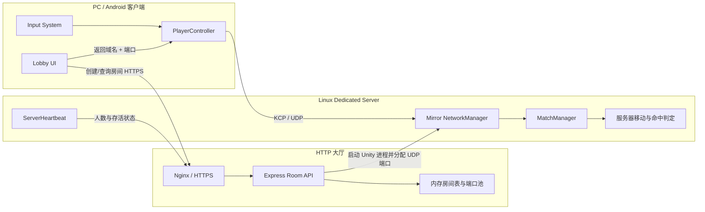
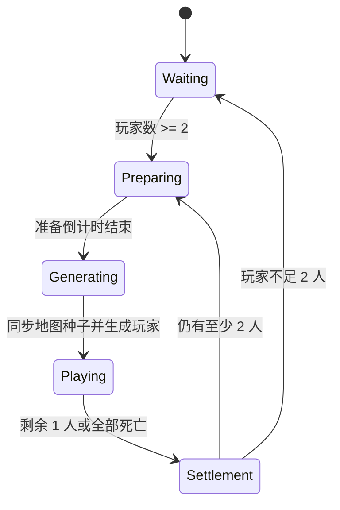

# OnlineTanks（坦克大战）

<p align="center">
  
</p>

一个使用 Unity、Mirror 与 KCP 实现的 2D 多人联机坦克对战学习项目。项目同时包含局域网 Host 模式、HTTP 大厅 + Linux Dedicated Server 模式、PC/Android 输入适配、服务器房间状态机、确定性地图、对象池和多种武器。

本仓库适合用于学习和参考，不应在未经安全加固的情况下直接作为公开运营服务器使用。文档会区分“已经投入玩法流程的代码”“实验性代码”和“空占位脚本”。

## 目录

- [项目状态](#项目状态)
- [技术栈与环境](#技术栈与环境)
- [总体架构](#总体架构)
- [快速开始](#快速开始)
- [操作方式](#操作方式)
- [核心系统原理](#核心系统原理)
- [在线大厅 API](#在线大厅-api)
- [脚本索引](#脚本索引)
- [迁移到自己的项目](#迁移到自己的项目)
- [构建与部署](#构建与部署)
- [已知限制与安全事项](#已知限制与安全事项)

## 项目状态

当前已实现：

- 局域网房间发现、Host 建房和加入房间。
- HTTP 大厅获取房间列表、动态创建 Linux Dedicated Server 房间。
- 2 至 8 人房间配置，房间满员拒绝连接。
- `Waiting -> Preparing -> Generating -> Playing -> Settlement` 比赛状态机。
- PC 与 Android 操作适配。
- 玩家名称、颜色、房间玩家列表和踢出提示。
- 普通、三连发、连射、巨型子弹和反射激光五种开火模式。
- 服务器判定命中、死亡、胜负与下一局。
- 使用统一随机种子在各端生成相同墙体布局。
- 子弹、激光线、爆炸特效对象池。
- Dedicated Server 心跳、房间人数上报和服务器端进程回收方案。

仍属于原型或未完成的部分：

- 没有账号、鉴权、匹配分、数据库或断线重连。
- `EnemyAI`、`TankHealth`、`WeaponSystem` 和自定义玩家状态机仍是占位/草稿。
- 当前玩法为一次命中即死亡，不是血量制。
- 服务器端反作弊、请求鉴权和输入限速仍需补充。

## 技术栈与环境

| 项目 | 版本/说明 |
|---|---|
| Unity | `6000.3.12f1` |
| 渲染管线 | Universal Render Pipeline `17.3.0` |
| 联机框架 | Mirror `96.0.1`（源码位于 `Assets/Plugins/Mirror`） |
| 传输层 | KCP/UDP（kcp2k） |
| 输入 | Unity Input System `1.19.0` |
| UI | UGUI + TextMeshPro |
| 大厅服务 | Node.js + Express |
| 反向代理 | Nginx（HTTPS 与 `/api/` 代理） |
| 目标平台 | Windows x64、Android ARM64、Linux x64 Dedicated Server |
| Android | 最低 API Level 25；项目版本 `1.0`、Version Code `1` |

打开项目时应从 Unity Hub 安装对应编辑器，并按需要安装 Windows Build Support、Android Build Support 和 Linux Dedicated Server Build Support。

## 总体架构



项目有两条建房路径：

1. **LAN 模式**：一台玩家设备调用 `StartHost()`，`LANDiscovery` 使用局域网广播发现房间，Host 同时承担客户端和服务器。
2. **Server 模式**：客户端请求 HTTP 大厅，大厅从 `7777-7799` 端口池中分配端口并启动一个 Linux Unity 进程，所有玩家只作为客户端连接 Dedicated Server。

## 项目结构

```text
OnlineTanks/
├─ Assets/
│  ├─ Art/                       美术、字体、音效、材质和模型
│  ├─ Linux/                    Node 大厅示例与 Linux 启动脚本
│  ├─ Plugins/Mirror/           Mirror 96.0.1 源码及 KCP Transport
│  ├─ Prefabs/                  Player、HitBox、Bullet、Pickup、UI、VFX
│  ├─ Scenes/
│  │  ├─ Lobby.unity            持久管理器、大厅 UI、NetworkManager
│  │  ├─ Game.unity             地图、墙体、出生点、相机与激光池
│  │  └─ Test/                  独立连接测试场景
│  └─ Scripts/                  本项目业务代码
├─ Packages/                    Unity Package Manager 配置
├─ ProjectSettings/             Unity 与构建设置
├─ Build/                       本地 Windows 构建（Git 忽略）
├─ AndroidBuild/                本地 Android 构建（APK 被 Git 忽略）
└─ LinuxSeverBuild/             Linux Dedicated Server 构建
```

> `LinuxSeverBuild` 沿用了项目现有拼写。新的项目建议使用 `LinuxServerBuild`。

## 快速开始

### 1. 获取并打开项目

```bash
git clone https://github.com/miao1suki/OnlineTanks.git
```

在 Unity Hub 中选择仓库内的 `OnlineTanks` 文件夹。首次导入会花费较长时间，不要把 `Library`、`Temp`、`Logs` 等生成目录提交到 Git。

Build Settings 中应至少保留以下场景顺序：

1. `Assets/Scenes/Lobby.unity`
2. `Assets/Scenes/Game.unity`

`Lobby` 是 Mirror 的 Offline Scene，`Game` 是 Online Scene。连接成功后 Mirror 自动切换到 `Game`；断开后返回 `Lobby`。

### 2. Inspector 必查项

在运行前检查 `Lobby` 场景中的 `NetworkManager`：

- 组件类型必须是 `NetworkManagerCustom`。
- Transport 使用 `KcpTransport`。
- `Player Prefab` 指向 `Assets/Prefabs/Player/Player.prefab`。
- `Hit Box Prefab` 指向 `PlayerHitBox.prefab`。
- Spawn Prefabs 至少注册道具和独立 HitBox 等由服务器动态生成的网络预制体。
- Offline Scene 为 `Lobby`，Online Scene 为 `Game`。

检查 `Player` Prefab：

- `NetworkIdentity`、`PlayerController`、`PlayerInputHandler`、`PlayerData`。
- `Rigidbody2D` 与所需的 Collider2D。
- `PlayerController.firePoint` 必须指向炮口 Transform。
- `PlayerController.laserWallMask` 指向 Wall Layer。
- `PlayerController.laserHitMask` 指向 PlayerHitBox Layer。
- `PlayerData.renderers` 包含所有需要换色的 SpriteRenderer。
- `PlayerController.hitBox` 保持为空，它由服务器在玩家加入时创建并绑定。

检查 `Game` 场景：

- 出生点具有 `SpawnPoint` Tag。
- `WallVisibilityController.wallRoot` 指向所有预放墙体的共同父节点。
- `LaserLinePool` 已绑定 LineRenderer Prefab。
- 场景内有 `CameraShakeManager` 和标记为 MainCamera 的相机。

### 3. 测试 LAN

1. 在编辑器打开 `Lobby`。
2. 选择 LAN 模式并创建房间，当前实例会执行 `StartHost()`。
3. 启动另一个构建版本，选择 LAN 模式并搜索。
4. 点击房间条目加入。

同一台机器测试多个客户端时，可使用一个 Editor 加一个独立构建，或使用适合 Unity 的多实例测试工具。多个实例不能同时以服务器身份监听同一个 UDP 端口。

### 4. 测试在线 Dedicated Server

在线模式默认访问以下接口：

```text
https://meowgame.cloud/api/createRoom
https://meowgame.cloud/api/rooms
https://meowgame.cloud/api/heartbeat
https://meowgame.cloud/api/removeRoom
```

点击创建房间后，`CreateRoomService` 从 API 获得域名和端口，修改 `NetworkManager.networkAddress` 与 `KcpTransport.port`，然后调用 `StartClient()`。

若要部署自己的服务，必须替换代码中硬编码的域名。更推荐抽取一个 `ScriptableObject` 或环境配置类统一管理 API Base URL 和游戏域名，避免分别修改多个脚本。

## 操作方式

### PC

| 操作 | 默认按键 |
|---|---|
| 前进/后退 | `W/S` 或方向键上下 |
| 转向 | `A/D` 或方向键左右 |
| 炮口朝向 | 鼠标位置 |
| 开火 | 鼠标左键或 Enter |
| 加速 | 鼠标右键或左 Shift |
| 菜单 | Esc |
| 投降 | 进入 Playing 120 秒后按 `B` |

### Android

- 虚拟摇杆同时控制坦克朝向与前进力度。
- 开火按钮写入本地玩家的单帧 `FirePressed`。
- Boost 按钮按下/抬起控制 `BoostHeld`。
- 操作 Canvas 仅在移动平台、Playing 阶段且本地玩家存活时显示。
- 振动开关通过 `PlayerPrefs` 保存。

## 核心系统原理

### 场景与网络生命周期

`NetworkManagerCustom` 扩展 Mirror `NetworkManager`，把网络状态转换为项目事件：

```text
ServerRunning -> Dedicated/LAN Host 已启动
Connected     -> 客户端已连接
InRoom        -> 已完成 Online Scene 切换
Disconnected  -> 清理比赛/UI并恢复 Lobby
```

服务器添加玩家时会：

1. 检查 `maxConnections`，满员则发送 `ServerRejectMessage` 后断开。
2. 实例化 Player Prefab，并用 `NetworkServer.AddPlayerForConnection` 建立权限归属。
3. 单独生成一个网络 HitBox，绑定玩家 `netId`。
4. 把玩家注册到 `MatchManager`。

独立 HitBox 的目的，是让服务器碰撞判定与客户端坦克表现分离，并通过 `ownerId` 可靠定位玩家。

### 比赛状态机

比赛状态完全由服务器的 `MatchManager` 推进：



默认代码时间：准备 10 秒、地图生成 3 秒、结算 5 秒。倒计时使用 `NetworkTime.time` 和服务器同步的结束时间戳，避免每个客户端各自倒计时产生漂移。

在 Playing 阶段加入的玩家会保持死亡/观战状态，等待下一局。每局开始时服务器保存参赛玩家集合、随机出生，并可能生成一个武器道具。

### 移动同步

移动链路如下：

```text
PlayerInputHandler
  -> PlayerController.ClientPredict（本地立即表现）
  -> CmdSendInput(move, look, boosting)
  -> ServerSimulate（服务器再次模拟）
  -> syncPos / syncRot
  -> 非本地玩家 LateUpdate 插值
```

这种结构提供了基础客户端预测，降低本地操作延迟，同时保留服务器模拟。公开服务器还应在服务器端限制输入向量、速度、转向率和 Command 调用频率。

当前 Player Prefab 同时启用了 Client-to-Server `NetworkTransformUnreliable` 和自定义 `syncPos/syncRot`。它们会重复同步 Transform；迁移时应明确选择一种方案，避免抖动和额外带宽。若强调服务器权威，建议关闭 Client-to-Server NetworkTransform，保留输入上传与服务器状态下发。

### 子弹与命中

普通子弹不是每次都进行 Mirror Spawn，而是服务器与各客户端分别从本地 `BulletPool` 取得表现对象：

1. 客户端调用 `CmdTryFire`。
2. 服务器决定开火模式并创建唯一 `shotId`。
3. 服务器生成用于物理判定的子弹。
4. `RpcSpawnBullet` 让其他客户端生成对应表现子弹。
5. 服务器 HitBox 命中后调用 `Die()`。
6. `(ownerId, shotId)` 组成 64 位 Key，`RpcReturnBullet` 精确回收各端同一发子弹。

五种模式：

| 模式 | 原理 |
|---|---|
| Normal | 单发直线子弹 |
| Triple | 正前方和正负 15 度各一发 |
| Burst | 约 1 秒内每 0.05 秒发射一次 |
| BigBullet | 放大子弹并忽略对发射者的自伤 |
| Laser | 服务器 Raycast 计算墙面反射路径，沿每段 CircleCast 命中 HitBox，再 RPC 绘制 LineRenderer |

`CmdTryFire` 目前没有服务器冷却与枪口合法性校验。客户端 UI 中的冷却只能改善正常操作体验，不能作为反作弊边界。

### 道具

`MatchManager` 每局进行一次五等概率抽签：

- 20% 不生成道具。
- 其余四种武器道具各 20%。

道具由服务器 `NetworkServer.Spawn`。`PickupItem` 使用 SyncVar 同步类型和外观，只有服务器处理 Trigger；拾取后修改玩家 `currentFireMode` 并销毁道具。

当前强化没有弹药数或持续时间，会保留到死亡、复活或拾取另一种道具。

### 确定性地图

地图不是同步所有墙的开关状态，而是只同步一个 64 位随机种子：

1. 服务器在 Generating 阶段产生 `currentMapSeed`。
2. `MatchManager` 通过 SyncVar 保存种子，保证晚加入者也能收到。
3. 各端 `WallVisibilityController` 按共同的墙体子节点顺序应用种子。
4. `SeedWallSelector` 使用 SplitMix64 伪随机数和 Floyd 抽样算法，以 O(k) 空间选出不重复墙体索引。

这种方案网络负载低，但要求所有端的 `wallRoot` 子节点数量和顺序完全相同。调整层级顺序会让同一 seed 产生不同地图。

### 玩家资料与 UI

- `LocalPlayerData` 在进入房间前暂存本地名字和颜色。
- 本地玩家生成后，`PlayerData.OnStartLocalPlayer` 通过 Command 写入服务器。
- 名字和颜色使用 SyncVar；hook 更新 Sprite 和名称 UI。
- `MatchManager.allPlayerIds` 是 SyncList，变化后客户端重建房间玩家列表。
- `RoomCanvasController` 根据房间状态显示玩家、倒计时、投降提示和胜者。

`LocalPlayerData` 只在当前进程内保存；需要跨启动保存玩家名时，可改用 `PlayerPrefs` 或账号资料服务。

### 对象池与表现

- `BulletPool`：每个玩家单独预热子弹队列，避免高频 Instantiate/Destroy。
- `LaserLinePool`：预热 LineRenderer，TTL 到期回收。
- `VFXManager`：仅在 Game 场景建立爆炸粒子池；batch mode 不播放。
- `AudioEffectManager`：跨场景单例，使用 `PlayOneShot` 并对高频音效节流。
- `CameraShakeManager`：本地相机位移震动，移动端可附加系统振动。

### 房间心跳与进程回收

仓库中的 `Assets/Linux/sever.js` 是最小教学实现：

- `7777-7799` 作为动态游戏端口池。
- 创建房间时启动一个 `test1.x86_64` 进程。
- Dedicated Server 每 10 秒上报端口、人数和最大人数。
- 示例脚本在连续 30 秒没有心跳时按端口清理进程。

心跳只能证明进程还活着，不能证明房间里有人。生产部署还应增加：

- 空房间持续超时，例如人数为 0 达 60 秒后关闭。
- Unity 启动后在限定时间内没有首次心跳则关闭。
- 保存启动后的 PID/进程组，先发 SIGTERM，超时后 SIGKILL。
- 大厅重启时扫描并处理失去登记的孤儿进程。
- 释放端口前确认旧进程和 UDP 监听已退出。

线上部署当前采用 35 秒心跳超时、45 秒首次心跳超时和 60 秒空房间超时。仓库示例没有包含全部生产加固逻辑，参考者不应原样暴露到公网。

## 在线大厅 API

请求目前使用 `application/x-www-form-urlencoded`（Unity `WWWForm`），响应为 JSON。

### 创建房间

```http
POST /api/createRoom
name=MyRoom&maxPlayers=4
```

```json
{
  "success": true,
  "room": {
    "roomName": "MyRoom",
    "address": "game.example.com",
    "port": 7777,
    "playerCount": 0,
    "maxPlayers": 4
  }
}
```

### 获取房间

```http
GET /api/rooms
```

```json
{
  "rooms": [
    {
      "roomName": "MyRoom",
      "address": "game.example.com",
      "port": 7777,
      "playerCount": 1,
      "maxPlayers": 4
    }
  ]
}
```

### 心跳

```http
POST /api/heartbeat
port=7777&playerCount=1&maxPlayers=4
```

### 删除房间

```http
POST /api/removeRoom
port=7777
```

公网部署必须为管理型接口增加鉴权。不能仅依靠端口号决定调用者是否有权刷新或关闭房间。

## 脚本索引

以下仅列出项目自定义代码；`Assets/Plugins/Mirror` 内为第三方框架和示例。

### Core 与 Data

| 脚本 | 作用 |
|---|---|
| `Core/AudioEffectManager.cs` | 跨场景音效单例；爆炸、射击、拾取和不同武器音效；带最小间隔节流。 |
| `Core/GameManager.cs` | 监听网络状态、管理 Lobby 显隐、主动离房和全局联机状态清理。 |
| `Core/MySceneManager.cs` | 空占位脚本，当前没有场景管理逻辑。 |
| `Core/PlayerInput.inputactions` | Move、Look、Attack、Pause、Surrender、Boost 等 Input Action 定义。 |
| `Core/PlayerInput.cs` | Input System 自动生成的 C# 包装器；应修改 `.inputactions` 后重新生成，不要手改。 |
| `Core/UIManager.cs` | 空占位脚本。 |
| `Core/VFXManager.cs` | 跨场景爆炸粒子池，在 Game 场景创建和回收特效。 |
| `Data/GameConfig.cs` | 空占位脚本，尚未形成集中配置系统。 |
| `Data/LocalPlayerData.cs` | 进程内暂存本地玩家名与颜色索引。 |
| `Data/PlayerColorConfig.cs` | 六种玩家颜色及十六进制颜色转换。 |
| `Data/PlayerData.cs` | Mirror SyncVar 同步玩家名/颜色，Command 提交本地资料，hook 更新外观。 |
| `Data/SettingData.cs` | 使用 PlayerPrefs 保存振动开关并发布变化事件。 |

### Gameplay

| 脚本 | 作用 |
|---|---|
| `Gameplay/Camera/CameraShakeManager.cs` | 客户端相机震动和可选移动端振动。 |
| `Gameplay/Combat/Bullet.cs` | 子弹速度、寿命、尺寸、Owner/Shot 编号和回池。 |
| `Gameplay/Combat/BulletPool.cs` | 按玩家建立子弹池，用 `(ownerId, shotId)` 对齐各端子弹。 |
| `Gameplay/Combat/FireMode.cs` | 五种开火模式枚举。 |
| `Gameplay/Combat/LaserLinePool.cs` | LineRenderer 激光表现池。 |
| `Gameplay/Combat/PickupItem.cs` | 同步道具类型与 Sprite，服务器拾取判定和武器切换。 |
| `Gameplay/Combat/PickupType.cs` | 四种强化道具枚举。 |
| `Gameplay/Combat/PlayerHitBox.cs` | 服务器独立命中盒，跟随玩家并处理子弹碰撞。 |
| `Gameplay/Combat/WeaponSystem.cs` | 空占位脚本；武器逻辑目前位于 `PlayerController`。 |
| `Gameplay/Enemy/EnemyAI.cs` | 空占位脚本，未实现敌人 AI。 |
| `Gameplay/Map/WallVisibilityController.cs` | 收集预放墙体，按 seed 和比例/数量显示墙体。 |
| `Gameplay/Match/MatchManager.cs` | 服务器比赛状态机、玩家注册、地图种子、出生、道具、胜负和循环。 |
| `Gameplay/Match/RoomState.cs` | Waiting、Preparing、Generating、Playing、Settlement 枚举。 |
| `Gameplay/Player/MoveState.cs` | 状态机草稿中的空移动状态，尚未接入玩法。 |
| `Gameplay/Player/PlayerController.cs` | 移动、预测、服务器模拟、武器、死亡、复活、投降、踢人和同步的核心类。 |
| `Gameplay/Player/PlayerInputHandler.cs` | 把 Input Action 和移动 UI 转为统一输入状态。 |
| `Gameplay/Player/PlayerNameTag.cs` | Playing 且存活时显示跟随玩家的名称。 |
| `Gameplay/Player/PlayerState.cs` | 玩家状态基类草稿。 |
| `Gameplay/Player/PlayerStateMachine.cs` | Enter/Update/Exit 状态切换草稿，当前未被 PlayerController 使用。 |
| `Gameplay/Player/TankHealth.cs` | 空占位脚本；当前为一次命中死亡。 |

### Network

| 脚本 | 作用 |
|---|---|
| `Network/LAN/LANDiscovery.cs` | Mirror Discovery 请求/响应，广播房间名、人数和 URI。 |
| `Network/LAN/LANRoomCreator.cs` | LAN Host 创建、广播和停止房间。 |
| `Network/NetworkManagerCustom.cs` | 扩展 Mirror 生命周期，满员拒绝、生成玩家/HitBox、注册比赛玩家、场景事件。 |
| `Network/NetworkPlayer.cs` | 空占位脚本。 |
| `Network/Online/CreateRoomService.cs` | 请求 HTTP 大厅创建房间并连接返回的域名与端口。 |
| `Network/Online/IgnoreSSL.cs` | 无条件接受 TLS 证书；仅适合临时调试，生产必须移除。 |
| `Network/Online/OnlineService.cs` | 获取 HTTP 房间列表并连接房间。 |
| `Network/Online/RoomInfo.cs` | 房间 JSON 数据模型。 |
| `Network/Online/ServerBootstrap.cs` | 解析 `-server`、`-port`、`-maxPlayers`，配置 KCP 并启动 Mirror Server。 |
| `Network/Online/ServerHeartbeat.cs` | Dedicated Server 每 10 秒上报端口/人数，退出时尝试移除房间。 |
| `Network/RoomService.cs` | LAN 与 HTTP Server 两种房间源的统一搜索、发现和连接入口。 |

### UI

| 脚本 | 作用 |
|---|---|
| `UI/EscMenuController.cs` | 游戏内 Esc 菜单、恢复和退出房间。 |
| `UI/HealthUI.cs` | 空占位脚本。 |
| `UI/KickToastUI.cs` | 跨场景 Lobby/Game 提示及淡出。 |
| `UI/LobbyCanvasSingleton.cs` | 保持 Lobby Canvas 跨场景并回填 GameManager 引用。 |
| `UI/LobbyUI.cs` | 空占位脚本。 |
| `UI/MobileBoostButton.cs` | Pointer 事件控制本地 Boost。 |
| `UI/MobileControlCanvasController.cs` | 按平台、比赛状态和本地存活状态控制移动 UI。 |
| `UI/MobileFireButton.cs` | Pointer 事件触发本地单帧开火。 |
| `UI/MobileTankJoystick.cs` | 移动端摇杆，输出朝向与前进力度。 |
| `UI/PlayerListItem.cs` | 玩家列表条目、名称刷新和踢出按钮。 |
| `UI/PlayerPreview.cs` | Lobby 玩家颜色预览。 |
| `UI/RoomCanvasController.cs` | 房间阶段、玩家列表、倒计时、结算和投降提示。 |
| `UI/RoomItem.cs` | 房间列表条目的 UI 引用容器。 |
| `UI/UIController.cs` | Lobby 模式切换、搜索、列表生成、Ping、加入、名字和颜色输入。 |
| `UI/VibrationToggleUI.cs` | Toggle 与振动设置双向同步。 |

### Utils、测试与服务器脚本

| 脚本 | 作用 |
|---|---|
| `Utils/Extensions.cs` | 空占位脚本。 |
| `Utils/JsonHelper.cs` | 包装顶层 JSON 数组以兼容 `JsonUtility`。 |
| `Utils/ObjectPool.cs` | 空占位脚本；实际对象池是 Bullet/VFX/LaserLine 各自实现。 |
| `Utils/PingUtility.cs` | 异步 ICMP Ping；失败返回 `-1`。 |
| `Utils/ScanUIBindings.cs` | Editor 菜单 `Tools/Scan UI Bindings`，输出 Button/EventTrigger 持久绑定。 |
| `Utils/SeedWallSelector.cs` | SplitMix64 + Floyd 算法确定性选墙。 |
| `Utils/Singleton.cs` | 空占位脚本。 |
| `Utils/SpawnPointMarker.cs` | 在 Scene 视图绘制出生点 Gizmo。 |
| `Utils/TextAnim.cs` | TextMeshPro 字符间距过渡动画。 |
| `Scenes/Test/TestScripts/TestNetworkManager.cs` | 最小 Mirror 连接/断开事件测试。 |
| `Scenes/Test/TestScripts/TestUIController.cs` | Test 场景连接、断开按钮和状态文字。 |
| `Assets/Linux/sever.js` | Express 房间表、端口分配、Unity 进程启动、心跳与清理的教学版本。 |
| `Assets/Linux/start_unity_server.sh` | 以 batch/headless/server 参数启动单个 Linux Server。 |

## 迁移到自己的项目

不要直接复制整个 `Assets` 和 `ProjectSettings` 覆盖目标项目。先决定要复用的层级。

### 方案 A：只复用确定性地图

这是耦合最小的模块：

1. 复制 `SeedWallSelector.cs` 与 `WallVisibilityController.cs`，保留 `.meta`。
2. 建立一个墙体父节点，并保证所有客户端子节点顺序一致。
3. 在自己的服务器生成并同步一个 `long seed`。
4. 所有客户端调用 `ApplySeed(seed)`。

该模块不强依赖 Mirror；替换 seed 的同步来源即可用于其他网络框架。

### 方案 B：复用 LAN 房间

1. 安装 Mirror 96.x 并启用 KCP Transport 和 Mirror Discovery。
2. 复制 `LANDiscovery`、`LANRoomCreator`、`RoomService`、`RoomItem` 和相关 UI。
3. 在场景放置 `NetworkManagerCustom`、`KcpTransport` 与 `LANDiscovery`。
4. 为按钮绑定创建、搜索、加入和停止房间方法。
5. 根据自己的玩家系统改写 `OnServerAddPlayer`。

LAN 广播通常无法跨路由器或公网工作；公网房间应使用列表服务、Relay 或专用服务器。

### 方案 C：复用角色和战斗

需要同时迁移：

- Player 与 PlayerHitBox Prefab。
- `PlayerController`、`PlayerData`、`PlayerInputHandler`、`PlayerColorConfig`、`LocalPlayerData`。
- Bullet、Pickup、LaserLine 与 VFX Prefab/对象池。
- `FireMode`、`PickupType`、`Bullet`、`BulletPool`、`PlayerHitBox`、`PickupItem`、`LaserLinePool`。
- `MatchManager`、`RoomState`、`WallVisibilityController`、`SeedWallSelector`。
- `RoomCanvasController`、`PlayerListItem`、`KickToastUI`、`EscMenuController` 和移动端输入 UI。
- `AudioEffectManager`、`VFXManager`、`CameraShakeManager`、`SettingData`。
- `PlayerInput.inputactions` 及其自动生成的 `PlayerInput.cs`。
- 相关 Layer、Tag、Input Actions、Spawn Prefab 注册和 Physics 2D 碰撞矩阵。

`PlayerController` 直接引用以上多个管理器和 UI 单例。若只复制部分文件，应先删除这些直接依赖或改成接口/事件，否则目标项目无法编译。

建议先抽象以下接口再接入自己的项目：

```csharp
public interface IDamageable
{
    void ApplyDamage(int amount, uint attackerId);
}

public interface IWeaponOwner
{
    uint OwnerId { get; }
    Transform FirePoint { get; }
}
```

当前代码把移动、武器、死亡、踢人和网络同步集中在 `PlayerController`。大型项目应拆为 `MovementMotor`、`WeaponController`、`Health`、`NetworkPlayerAuthority` 等组件。

### 方案 D：接入自己的在线大厅

客户端真正依赖的是 API 数据契约，而不是 Express：

1. 实现创建房间、房间列表、心跳和删除房间四个接口。
2. 返回客户端可解析的域名、UDP 端口、人数和容量。
3. 用 Docker、systemd、Kubernetes 或其他调度器启动 Dedicated Server。
4. Dedicated Server 启动参数保持 `-server -port <port> -maxPlayers <n>`，或同步修改 `ServerBootstrap`。
5. 把 API 地址集中到配置中，替换项目硬编码域名。

如果使用其他网络框架，需要替换 `NetworkBehaviour`、SyncVar、Command、ClientRpc、TargetRpc 和 `NetworkServer/NetworkClient.spawned` 查询；确定性地图、对象池、武器反射算法和 UI 状态机仍可保留。

### Layer、Tag 与碰撞矩阵

项目使用的主要 Layer：

| Layer | 用途 |
|---|---|
| Player | 坦克表现与物理 |
| Bullet | 子弹 |
| Wall | 墙体和激光反射面 |
| PlayerHitBox | 服务器独立命中盒 |
| PickUp | 武器道具 |

必须存在 `SpawnPoint` Tag。碰撞矩阵至少满足：

- Player 与 Player/Wall 碰撞。
- Bullet 与 Wall/PlayerHitBox 交互。
- PlayerHitBox 与 Bullet/PickUp 触发。
- PickUp 与 PlayerHitBox 触发。

子弹反弹还依赖高弹性、低摩擦的 PhysicsMaterial2D。若删除 Mirror 示例资源，请创建自己的材质并重新绑定 Bullet Prefab。

## 构建与部署

### Windows 客户端

1. Build Profile 选择 Windows x86_64。
2. 场景包含 Lobby、Game。
3. 构建后必须整体分发 `.exe`、`*_Data`、`UnityPlayer.dll` 和依赖目录，不能只发送 exe。

### Android 客户端

1. 安装 Android Build Support、SDK、NDK 和 OpenJDK。
2. 项目当前配置 Android ARM64、Minimum API Level 25。
3. 工程启用了自定义 keystore，但密钥文件不会随公共仓库分发。首次克隆后需在 `Player Settings -> Publishing Settings` 中选择自己的 keystore；仅做本地调试时也可以关闭自定义 keystore，使用 Unity 的调试签名。
4. 使用自己的 keystore 后应在安全位置备份。不要提交 `*.keystore`、`*.jks` 或密码。
5. 后续升级必须持续使用同一个签名密钥。

### Linux Dedicated Server

构建时选择 Linux x86_64 Server/Dedicated Server 子目标。上传完整输出目录后：

```bash
chmod +x test1.x86_64
./test1.x86_64 \
  -batchmode \
  -nographics \
  -server \
  -port 7777 \
  -maxPlayers 4
```

除主程序外还必须分发 `test1_Data`、`UnityPlayer.so` 和所需 `.so` 文件。

服务器防火墙/安全组需要开放：

- TCP 80/443：HTTP/HTTPS 大厅。
- TCP 3000：只建议监听回环地址，由 Nginx 代理，不对公网开放。
- UDP 7777-7799：KCP 游戏房间。

Nginx 只代理 HTTP API；游戏流量为 KCP/UDP，客户端通过游戏域名和具体 UDP 端口直接连接。

### GitHub 发布包

构建产物应放在 GitHub Releases，而不是提交进 Git 历史。推荐附件命名：

```text
OnlineTanks-Windows-x64-vX.Y.Z.zip
OnlineTanks-Android-vX.Y.Z.apk
OnlineTanks-Linux-Server-x64-vX.Y.Z.tar.gz
SHA256SUMS.txt
```

Windows 和 Linux 包应排除 `*_BurstDebugInformation_DoNotShip`、运行日志和临时文件。

## 已知限制与安全事项

参考或二次开发前请逐条阅读：

1. **不要使用 `IgnoreSSL` 上线。** 它无条件接受任何证书，会失去 TLS 身份校验，存在中间人攻击风险。证书正确后应删除自定义 CertificateHandler。
2. **踢人权限仅在 UI 层限制。** `CmdKickPlayer` 没有服务器端 Host/角色校验，任何拥有自己 Player 对象权限的客户端都可能直接发 Command 踢人。
3. **投降时间仅在客户端限制。** 服务器 `CmdSurrender` 没有验证 Playing 状态或 120 秒条件。
4. **开火缺少服务器限速。** `CmdTryFire` 信任客户端上传的枪口位置和方向，也没有服务器冷却检查。
5. **移动输入需要校验。** 服务器应 Clamp 输入并检查速度、转向和 Command 频率。
6. **存在重复 Transform 同步。** 自定义 SyncVar 插值与 Client-to-Server NetworkTransform 同时启用；应保留一种明确方案。
7. **比赛中断线可能不触发结算。** `UnregisterPlayer` 先移除 ID，再调用 `OnPlayerDead`，后者会因 ID 不在列表而返回。
8. **生成阶段掉线可能产生状态回跳。** `PreparingRoutine` 通过新的 Coroutine 启动 `GenerateRoutine`，但 `matchFlowRoutine` 没有改为指向它；人数不足时停止旧引用，生成协程仍可能把 Waiting 再推进到 Playing。应把完整流程放进同一协程或分别保存并停止引用。
9. **没有服务器比赛总超时。** 120 秒只是客户端开放投降；所有玩家都不操作时不会自动结算。
10. **公网 API 没有鉴权。** 示例的创建、心跳和删除接口不能直接信任公网请求，应加入服务身份令牌、签名、限流和参数校验。
11. **房间表只存在内存。** 大厅重启会丢失登记，需要持久化或进程扫描与状态恢复。
12. **出生点不排重。** 玩家与道具可能选择同一位置；应在一局内抽取不重复出生点并检查碰撞空间。
13. **ICMP Ping 不是端口健康检查。** 网络屏蔽 Ping 时 UI 会显示 `--`，这不代表 KCP 房间不可连接。
14. **桌面瞄准直接读取鼠标。** 当前 Gamepad Look Action 不会驱动桌面瞄准，需要统一输入来源。
15. **所有 Player Prefab 都创建输入对象。** 应只为本地玩家启用 Input Action，避免远端对象重复监听输入。
16. **若干脚本仍为空。** 不要把 `EnemyAI`、`TankHealth`、`WeaponSystem`、`HealthUI` 等当作已实现模块。
17. **Prefab/Scene 序列化值可能覆盖代码默认值。** 调参时同时检查脚本默认值和 Inspector 实际值。
18. **确定性地图依赖层级顺序。** 所有构建必须使用相同 Game 场景和墙体子节点顺序。
19. **Android 签名文件必须保密。** 不要把 keystore、别名密码或密钥密码提交到公共仓库或 Release。

## 调试建议

- 使用 `Tools -> Scan UI Bindings` 检查当前场景 Button/EventTrigger 的持久化绑定。
- 通过服务器日志区分大厅 API、Unity 启动、Mirror 连接和 KCP 断线问题。
- 同时记录 `port`、`connectionId`、`netId` 和 `(ownerId, shotId)`，便于定位跨端对象。
- 测试至少覆盖 Host、普通客户端、Dedicated Server、晚加入、满员、主动退出、异常断线和大厅重启。
- 网络问题不要只看客户端 UI；同时检查 UDP 监听、服务器进程、心跳时间和 Mirror 日志。

## License

本项目使用 [MIT License](LICENSE)。第三方依赖仍受其各自许可证约束。
